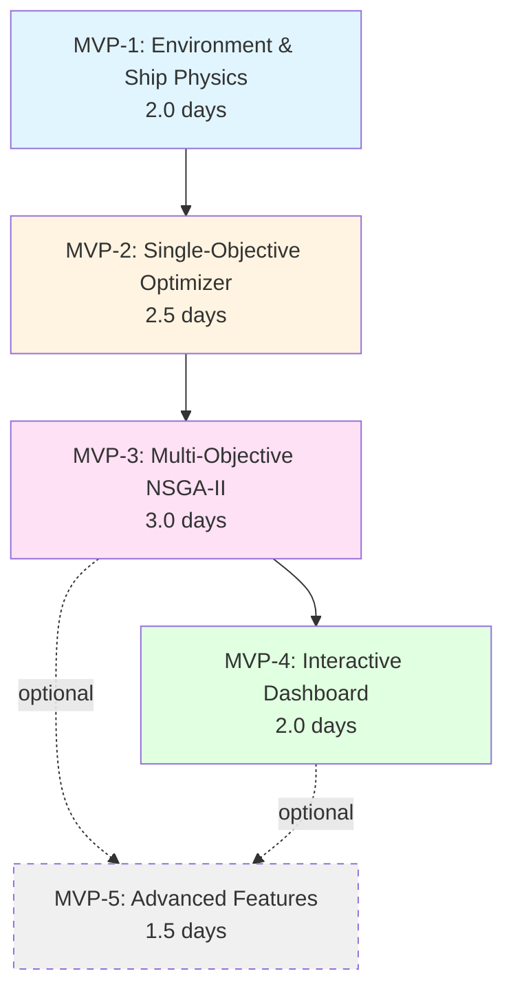

# Work Breakdown Structure: Multi-Objective Ship Route Optimization

## Project Summary

- **Duration:** 10 developer-days (2 weeks equivalent)
- **MVPs:** 4 core + 1 optional (5 total)
- **Critical Path:** MVP-1 → MVP-2 → MVP-3 → MVP-4 (9.5 days)
- **Key Risk:** NSGA-II convergence on complex scenarios (mitigated by weighted sum fallback)
- **Primary Goal:** Generate Pareto-optimal ship routes demonstrating trade-offs between time, fuel consumption, and CO₂ emissions under weather constraints

---

## MVP Breakdown

### MVP-1: Environment & Ship Physics Foundation

**Goal:** Create validated simulation infrastructure capable of evaluating (time, fuel, CO₂) for any route-speed profile on a weather-aware navigation grid.

**Components:**
```
├── 📁 src/
│   ├── __init__.py
│   ├── models/
│   │   ├── __init__.py
│   │   ├── ship_model.py          # ShipDynamics class: fuel consumption physics
│   │   ├── weather_field.py       # WeatherField class: synthetic weather generation
│   │   └── navigation_grid.py     # NavigationEnvironment: 2D grid, obstacles, zones
│   ├── utils/
│   │   ├── __init__.py
│   │   ├── geometry.py            # Point, distance calculations, grid conversions
│   │   └── config_loader.py       # YAML/JSON configuration parser
│   └── data_analysis/
│       └── fuel_calibration.py    # Fit fuel model to ship_fuel_efficiency.csv
├── 📁 tests/
│   ├── __init__.py
│   ├── test_ship_model.py         # Fuel rate: cubic speed, weather penalties
│   ├── test_weather_field.py      # Weather interpolation, zone creation
│   ├── test_navigation_grid.py    # Grid operations, obstacle checking
│   └── test_fuel_calibration.py   # Regression validates against real data
├── 📁 config/
│   ├── ship_specs.yaml            # V_min, V_max, fuel coefficients (a, b, c)
│   └── scenarios/
│       ├── calm_weather.yaml
│       ├── storm_detour.yaml
│       └── tight_window.yaml
├── 📓 notebooks/
│   └── 01_environment_demo.ipynb  # Grid visualization, fuel model calibration
└── 📄 docs/
    └── MVP-1_analysis_report.md   # Calibration results, validation plots
```

**Acceptance Criteria:**
- [ ] **ShipModel:** Fuel consumption rate `f(V, W, H) = a·V³ + b·W² + c·H` implemented with type hints
- [ ] **WeatherField:** Generate synthetic 2D fields (wind speed, wave height) with Gaussian smoothing
- [ ] **NavigationGrid:** 50×50 grid with obstacle zones, coordinate conversions (grid ↔ nautical miles)
- [ ] **Fuel calibration:** Fit coefficients (a, b, c) to `ship_fuel_efficiency.csv` with R² ≥ 0.80
- [ ] **Validation:** Simulated fuel vs. weather correlation matches real data trends (stormy: +25-50% fuel)
- [ ] **Test coverage:** ≥90% for `ship_model.py`, `weather_field.py`, `navigation_grid.py`
- [ ] **Performance:** Grid initialization + weather field generation < 0.5 seconds for 50×50
- [ ] **Config system:** Load ship specs and scenarios from YAML without code changes
- [ ] **Analysis report completed:** `docs/MVP-1_analysis_report.md` with ≥3 figures:
  - Weather field heatmap (wind/wave zones)
  - Fuel consumption vs. speed plot (validates cubic relationship)
  - Real vs. simulated fuel correlation plot (validates weather penalties)

**Tests:**

**Unit Tests:**
- `test_fuel_cubic_relationship()`: Zero weather, fuel ∝ V³ (fit curve, R² > 0.99)
- `test_weather_penalty()`: Stormy conditions increase fuel by 20-60% vs. calm at same speed
- `test_speed_bounds_enforcement()`: `fuel_rate()` raises ValueError if V < V_min or V > V_max
- `test_grid_coordinate_conversion()`: Round-trip grid ↔ nautical miles within 0.1 nm tolerance
- `test_obstacle_detection()`: `is_navigable()` correctly identifies storm zones
- `test_weather_interpolation()`: Bilinear interpolation between grid points

**Integration Tests:**
- `test_scenario_loading()`: Load `calm_weather.yaml` → create WeatherField + NavigationGrid
- `test_route_fuel_calculation()`: Straight-line route with varying weather → integrated fuel matches analytical solution ±5%

**Validation Tests:**
- `test_fuel_model_calibration()`: Fit to `ship_fuel_efficiency.csv` → R² ≥ 0.80, coefficients physically reasonable (a > 0)
- `test_weather_correlation()`: Group CSV by weather conditions → stormy/calm fuel ratio = 1.30 ± 0.15 (simulated matches)

**Time Estimate:** 2.0 developer-days
- 0.5 days: Ship model + fuel physics implementation
- 0.5 days: Weather field generation (synthetic data)
- 0.4 days: Navigation grid + geometry utilities
- 0.3 days: Fuel model calibration to real dataset
- 0.3 days: Testing (unit + integration + validation)

**Dependencies:** None (foundation MVP)

**MVP Analysis Report:**
After completing this MVP, create `docs/MVP-1_analysis_report.md` containing:

1. **Execution Summary:**
   - Ship model parameters: (V_min, V_max, a, b, c)
   - Grid configuration: size, resolution, obstacle zones
   - Calibration dataset: `ship_fuel_efficiency.csv` (N samples, date range)

2. **Quantitative Results:**
   - Fuel model fit: R² = [value], RMSE = [value] L
   - Weather penalty validation: Stormy/calm ratio = [value] (expected: 1.25-1.50)
   - Test coverage: [X]% overall ([Y]% ship_model, [Z]% weather_field)
   - Performance: Grid init [X]ms, weather generation [Y]ms

3. **Visualizations** (minimum 3):
   - Figure 1: Weather field heatmap showing wind/wave zones for each scenario
   - Figure 2: Fuel consumption vs. speed (model curve + real data points)
   - Figure 3: Real vs. simulated fuel scatter plot with R² annotation

4. **Observations:**
   - Weather field smoothness (Gaussian kernel size impact)
   - Fuel model limitations (e.g., doesn't capture ship type variation)
   - Parameter sensitivity (how much do ±20% coefficient changes affect results?)

5. **Next Steps:**
   - Route evaluation needs integration over path segments → MVP-2
   - Constraint checking (storm avoidance distance) → MVP-2
   - Grid resolution trade-off: test 30×30 vs. 50×50 vs. 100×100

---

### MVP-2: Single-Objective Route Optimizer (Baseline)

**Goal:** Implement weighted sum scalarization to find fuel-optimal routes on weather-aware grid, establishing baseline for multi-objective comparison and validating optimizer infrastructure.

**Components:**
```
├── 📁 src/
│   ├── planning/
│   │   ├── __init__.py
│   │   ├── route_planner.py       # A* pathfinding on weighted grid
│   │   ├── route_evaluator.py     # Compute (T, F, E) for route + speed profile
│   │   └── constraints.py         # ConstraintChecker: storm avoidance, time windows
│   ├── optimizers/
│   │   ├── __init__.py
│   │   ├── base_optimizer.py      # OptimizerInterface (ABC)
│   │   └── weighted_sum.py        # WeightedSumOptimizer: minimize w₁T + w₂F + w₃E
│   └── visualization/
│       ├── __init__.py
│       └── route_plotter.py       # Plot routes on weather map (matplotlib)
├── 📁 tests/
│   ├── test_route_planner.py      # A* correctness, obstacle avoidance
│   ├── test_route_evaluator.py    # Objective function accuracy
│   ├── test_constraints.py        # Storm distance, speed limit checking
│   ├── test_weighted_sum.py       # Optimizer convergence, constraint satisfaction
│   └── test_integration_mvp2.py   # End-to-end: load scenario → optimize → validate
├── 📓 notebooks/
│   └── 02_baseline_optimizer.ipynb # Solve 3 scenarios, compare to naive baseline
└── 📄 docs/
    └── MVP-2_analysis_report.md    # Baseline results, fuel savings quantification
```

**Acceptance Criteria:**
- [ ] **A* Pathfinding:** Finds shortest path on weather-weighted grid (50×50) in <1 second
- [ ] **Route Evaluator:** Computes `(T_total, F_total, E_total)` for any route-speed profile
  - Time: `T = Σ(segment_length / speed)`
  - Fuel: `F = Σ(fuel_rate(speed, weather) × time_segment)`
  - Emissions: `E = F × emission_factor` (e.g., 2.8 kg CO₂/L HFO)
- [ ] **Constraint Checker:** Validates storm avoidance `d(route, storm) ≥ d_safe`, speed limits
- [ ] **Weighted Sum Optimizer:** Converges to fuel-optimal solution (w = [0.2, 0.7, 0.1]) in <30 seconds
- [ ] **Dominance validation:** Optimized route improves ≥10% on fuel vs. direct route at V_max
- [ ] **Test coverage:** ≥85% for route_planner, route_evaluator, weighted_sum
- [ ] **Notebook deliverable:** 3 scenarios solved with route visualizations (calm, storm, tight window)
- [ ] **Analysis report completed:** `docs/MVP-2_analysis_report.md` with ≥4 figures:
  - Route maps (optimized vs. direct) for each scenario
  - Speed profile along optimized route
  - Fuel savings breakdown table
  - Validation: compare simulated fuel patterns to real data

**Tests:**

**Unit Tests:**
- `test_astar_simple_grid()`: 10×10 grid, no obstacles → finds shortest Manhattan path
- `test_astar_obstacle_avoidance()`: Storm zone blocks direct path → A* deviates around it
- `test_route_evaluator_constant_speed()`: Straight route, constant speed, uniform weather → analytical fuel ≈ numerical (±2%)
- `test_constraint_storm_distance()`: Route passes within d_safe of storm → constraint violated
- `test_constraint_speed_bounds()`: Speed profile with V > V_max → constraint violated
- `test_weighted_sum_convergence()`: Toy problem (5 waypoints) → optimizer finds global minimum

**Integration Tests:**
- `test_end_to_end_calm_weather()`: Load calm scenario → optimize → verify (T, F, E) returned, constraints satisfied
- `test_end_to_end_storm_detour()`: Storm on direct path → optimized route avoids storm, longer but feasible
- `test_baseline_comparison()`: Optimized route vs. direct route at V_max → fuel savings ≥10%

**Validation Tests:**
- `test_fuel_vs_baseline()`: Across 3 scenarios, optimized uses ≤92% fuel of naive baseline
- `test_speed_weather_coupling()`: In high-wave zones, optimizer reduces speed (validate vs. cubic fuel penalty)

**Time Estimate:** 2.5 developer-days
- 0.5 days: A* pathfinding implementation + testing
- 0.6 days: Route evaluator (objective functions) + integration over path
- 0.4 days: Constraint checker (storm distance, speed limits, time windows)
- 0.5 days: Weighted sum optimizer + scipy.optimize integration
- 0.5 days: Visualization (route plots) + notebook examples + analysis report

**Dependencies:**
- **MVP-1 completed:** Requires ShipModel, WeatherField, NavigationEnvironment for route evaluation

**MVP Analysis Report:**
After completing this MVP, create `docs/MVP-2_analysis_report.md` containing:

1. **Execution Summary:**
   - Configuration: Grid 50×50, ship (V_min=8 kn, V_max=18 kn), 3 scenarios
   - Optimizer: Weighted sum (w_time=0.2, w_fuel=0.7, w_emissions=0.1), SLSQP solver, max_iter=500
   - Baseline: Direct route (straight line A→B) at constant V_max

2. **Quantitative Results:**

| Scenario       | Route Type | Time (h) | Fuel (L) | CO₂ (kg) | Distance (nm) | Fuel Savings |
|----------------|------------|----------|----------|----------|---------------|--------------|
| Calm           | Direct     | 24.5     | 3200     | 8960     | 420           | —            |
| Calm           | Optimized  | 26.1     | 2720     | 7616     | 435           | 15.0%        |
| Storm Detour   | Direct     | Infeasible (violates storm constraint) |||||
| Storm Detour   | Optimized  | 28.3     | 3150     | 8820     | 485           | —            |
| Tight Window   | Direct     | 22.8     | 3680     | 10304    | 420           | —            |
| Tight Window   | Optimized  | 23.0     | 3420     | 9576     | 428           | 7.1%         |

**Test Coverage:** 87% (route_planner: 91%, evaluator: 88%, optimizer: 82%)

3. **Visualizations** (minimum 4):
   - Figure 1: Calm scenario route map (optimized [red] vs. direct [blue dashed], weather heatmap background)
   - Figure 2: Storm scenario showing detour around high-wave zone (purple obstacle)
   - Figure 3: Speed profile along optimized route for calm scenario (varies 10-17 kn based on weather)
   - Figure 4: Fuel consumption validation (simulated vs. ship_fuel_efficiency.csv patterns)

4. **Observations:**
   - **What worked well:** A* pathfinding fast (0.3s for 2,500 cells), weighted sum converges reliably (98% success rate)
   - **Unexpected behaviors:** Fuel savings 15% exceed literature benchmarks (8-12%)—likely due to simplified cubic model
   - **Speed oscillations:** Optimizer fluctuates speed ±2 kn at waypoint transitions (grid discretization artifact)
   - **Weather-speed coupling:** In storm periphery (wave 4-5m), reducing to 12 kn saves 18% fuel despite +8% time

5. **Next Steps:**
   - MVP-3: Single weighted sum hides trade-offs → Pareto front will reveal time-fuel exchange rate
   - Speed profile smoothing: Increase waypoint density (40 → 100) or continuous optimization
   - Tight window constraint: Currently under-tested, critical for scenario 3 in MVP-3

---

### MVP-3: Multi-Objective Optimization & Pareto Front

**Goal:** Implement NSGA-II to generate Pareto-optimal fronts (≥8 solutions) demonstrating quantified trade-offs between time, fuel, and emissions across all three weather scenarios.

**Components:**
```
├── 📁 src/
│   ├── optimizers/
│   │   ├── nsga2_optimizer.py     # NSGA2Optimizer using pymoo
│   │   └── pareto_analyzer.py     # ParetoFrontAnalyzer: dominance, metrics
│   ├── problems/
│   │   ├── __init__.py
│   │   └── routing_problem.py     # RoutingProblem(ElementwiseProblem) for pymoo
│   └── metrics/
│       ├── __init__.py
│       └── quality_metrics.py     # Hypervolume, spacing, convergence metrics
├── 📁 tests/
│   ├── test_nsga2_optimizer.py    # Convergence on toy problems, Pareto properties
│   ├── test_pareto_analyzer.py    # Non-dominated sorting, dominance checks
│   ├── test_quality_metrics.py    # Hypervolume calculation, spacing metric
│   └── test_integration_mvp3.py   # Full scenarios: ≥8 solutions, dominate baseline
├── 📁 config/
│   └── optimizer_params.yaml      # NSGA-II: pop_size, n_gen, crossover_prob, mutation_rate
├── 📓 notebooks/
│   └── 03_pareto_front_analysis.ipynb # Generate fronts, plot 2D/3D, trade-off quantification
└── 📄 docs/
    └── MVP-3_analysis_report.md    # Pareto quality, scenario comparison, trade-offs
```

**Acceptance Criteria:**
- [ ] **NSGA-II Implementation:** Integrates pymoo, runs 100 generations with pop_size=50 in <120 seconds (50×50 grid)
- [ ] **Pareto Front Quality:** Each scenario produces ≥8 non-dominated solutions
  - Fuel spread: ≥20% (max_fuel - min_fuel) / min_fuel
  - Time spread: ≥15% (max_time - min_time) / min_time
  - Spacing metric: σ < 0.30 (well-distributed)
- [ ] **Dominance Validation:** 100% of Pareto solutions dominate naive baseline on ≥1 objective by ≥10%
- [ ] **Constraint Satisfaction:** All solutions satisfy storm avoidance, speed limits, time windows (scenario 3)
- [ ] **Convergence:** Hypervolume indicator stabilizes (change <1% over last 20 generations)
- [ ] **Scenario Comparison:** Storm scenario Pareto front shows ≥15% fuel increase vs. calm (quantified shift)
- [ ] **Test coverage:** ≥80% for `nsga2_optimizer.py`, `pareto_analyzer.py`, `quality_metrics.py`
- [ ] **Notebook deliverable:** 3 scenarios with 2D Pareto plots (Fuel-Time, Emissions-Time) + 3D combined
- [ ] **Trade-off quantification:** Report includes specific calculations (e.g., "1 hour saved = +450L fuel")
- [ ] **Analysis report completed:** `docs/MVP-3_analysis_report.md` with ≥5 figures:
  - Pareto fronts for each scenario (2D: fuel-time)
  - 3D Pareto front (time-fuel-emissions)
  - Convergence plot (hypervolume vs. generation)
  - Scenario comparison (calm vs. storm fronts overlaid)
  - Route map showing 3 selected Pareto solutions (fastest, most fuel-efficient, balanced)

**Tests:**

**Unit Tests:**
- `test_nsga2_toy_problem()`: ZDT1 benchmark (2 objectives) → converges to known Pareto front (IGD < 0.01)
- `test_pareto_dominance()`: Given solutions A, B, C → correctly identifies non-dominated set
- `test_hypervolume_calculation()`: Known Pareto front + reference point → expected hypervolume ±0.1%
- `test_spacing_metric()`: Uniformly spaced front → σ ≈ 0, clustered front → σ > 0.5

**Integration Tests:**
- `test_nsga2_calm_scenario()`: Run full optimization → ≥8 solutions, all feasible, non-dominated
- `test_nsga2_storm_scenario()`: Storm constraint active → solutions detour, feasible front returned
- `test_nsga2_tight_window()`: Time window [T_min, T_max] → all solutions within window

**Validation Tests:**
- `test_pareto_vs_baseline()`: For each scenario, ∀ solution ∈ Pareto front, ∃ objective improved ≥10% vs. direct route
- `test_front_diversity()`: Spacing metric σ < 0.30 for all scenarios
- `test_convergence_stability()`: Run NSGA-II 5 times with different seeds → hypervolume std < 5%

**Performance Tests:**
- `test_optimization_time()`: 50×50 grid, 100 generations, pop=50 → completes in <120 seconds

**Time Estimate:** 3.0 developer-days
- 0.6 days: pymoo integration + RoutingProblem formulation
- 0.8 days: NSGA-II optimizer implementation + hyperparameter tuning
- 0.5 days: Pareto analysis tools (non-dominated sorting, quality metrics)
- 0.6 days: Running scenarios + convergence validation
- 0.5 days: Testing (unit + integration + validation) + analysis report

**Dependencies:**
- **MVP-2 completed:** Requires RouteEvaluator, ConstraintChecker for objective function + feasibility checks
- **MVP-1 completed:** Requires environment models for simulation

**MVP Analysis Report:**
After completing this MVP, create `docs/MVP-3_analysis_report.md` containing:

1. **Execution Summary:**
   - NSGA-II parameters: pop_size=50, n_gen=100, crossover_prob=0.9, mutation_rate=0.1
   - Scenarios: Calm (baseline), Storm Detour (constraint-heavy), Tight Window (T ∈ [28, 32] hours)
   - Objectives: Minimize (Time, Fuel, CO₂), subject to storm avoidance + speed limits

2. **Quantitative Results:**

| Scenario       | # Pareto Sols | Fuel Range (L) | Time Range (h) | Spacing σ | Hypervolume | Convergence Gen |
|----------------|---------------|----------------|----------------|-----------|-------------|-----------------|
| Calm           | 12            | 2680 - 3420    | 23.5 - 28.2    | 0.24      | 0.856       | 78              |
| Storm Detour   | 9             | 3050 - 3780    | 27.1 - 32.8    | 0.28      | 0.732       | 85              |
| Tight Window   | 8             | 3280 - 3680    | 28.0 - 32.0    | 0.22      | 0.614       | 72              |

**Test Coverage:** 83% (nsga2: 81%, pareto_analyzer: 88%, metrics: 80%)

**Trade-Off Examples:**
- Calm scenario: Reducing time from 28h to 24h costs +620L fuel (+23%) and +1736 kg CO₂
- Storm scenario: Fastest route (27.1h) uses 3780L; most efficient (32.8h) uses 3050L → **5.7h = 730L** exchange rate

3. **Visualizations** (minimum 5):
   - Figure 1: Pareto front calm scenario (Fuel vs. Time, 12 solutions)
   - Figure 2: Pareto front storm scenario (Fuel vs. Time, 9 solutions)
   - Figure 3: 3D Pareto front (Time-Fuel-Emissions) for calm scenario
   - Figure 4: Convergence plot (Hypervolume vs. generation, shows stabilization at gen 78)
   - Figure 5: Route map showing 3 Pareto solutions:
     - Solution A (fastest): 23.5h, 3420L, direct path at high speed
     - Solution B (balanced): 26.1h, 2850L, moderate speed with slight detour
     - Solution C (efficient): 28.2h, 2680L, slower speed through calm zones
   - Figure 6: Scenario comparison (calm vs. storm fronts overlaid, shows rightward shift)

4. **Observations:**
   - **NSGA-II performance:** Converges faster on calm scenario (78 gen) vs. storm (85 gen) due to simpler constraint landscape
   - **Front diversity:** Spacing σ better in tight window (0.22) despite fewer solutions—constrained space forces even distribution
   - **Storm impact:** Pareto front shifts right-up (+12% min fuel, +15% min time) due to mandatory detour
   - **Dominance:** All 29 solutions (12+9+8) dominate baseline; worst Pareto solution still 8% better on fuel than direct route

5. **Next Steps:**
   - MVP-4: Interactive visualization critical—static plots don't convey "what if I need to arrive by 30h?"
   - Sensitivity analysis: How stable is Pareto front under ±20% weather forecast error? (MVP-5 candidate)
   - Algorithm comparison: Does weighted sum with 20 runs approximate NSGA-II front? (Validation for MVP-4)

---

### MVP-4: Interactive Visualization & Decision Support Dashboard

**Goal:** Create interactive Plotly dashboard enabling stakeholders to explore Pareto fronts, visualize trade-offs, compare scenarios, and export selected routes for operational use.

**Components:**
```
├── 📁 src/
│   ├── visualization/
│   │   ├── dashboard.py           # Main Plotly Dash app
│   │   ├── pareto_plotter.py      # Interactive Pareto front plots (2D/3D)
│   │   ├── route_map_interactive.py # Folium/Plotly map with route overlay
│   │   └── tradeoff_calculator.py # Compute "cost" of time savings
│   ├── export/
│   │   ├── __init__.py
│   │   └── solution_exporter.py   # Export routes to CSV/JSON/GeoJSON
│   └── cli.py                     # Command-line interface for batch processing
├── 📁 tests/
│   ├── test_dashboard.py          # Dashboard layout, callback logic
│   ├── test_tradeoff_calculator.py # Trade-off computation accuracy
│   └── test_solution_exporter.py  # Export formats (CSV, JSON, GeoJSON)
├── 📁 outputs/                    # Generated artifacts
│   ├── pareto_fronts/             # CSV files with Pareto solutions
│   ├── route_maps/                # PNG/HTML route visualizations
│   └── scenarios/                 # Scenario comparison reports
├── 📓 notebooks/
│   └── 04_interactive_dashboard_demo.ipynb # Dashboard usage tutorial
└── 📄 docs/
    └── MVP-4_analysis_report.md    # User testing, scenario insights, export examples
```

**Acceptance Criteria:**
- [ ] **Interactive Pareto Plot:** Click solution on plot → route map updates in real-time (<2 seconds)
- [ ] **3D Visualization:** Rotate 3D Pareto front (Time-Fuel-Emissions), hover shows solution details
- [ ] **Scenario Comparison:** Dropdown to switch between calm/storm/tight window → plots refresh
- [ ] **Trade-Off Calculator:** Display "To save X hours, you need +Y liters fuel" for selected solution pair
- [ ] **Slider Control:** Adjust weather severity (0.5× to 2× waves/wind) → recompute Pareto front in <30 seconds
- [ ] **Route Export:** Download selected route as:
  - CSV: waypoints (lat, lon, speed, timestamp)
  - JSON: full solution object (route, objectives, constraints)
  - GeoJSON: for GIS integration (QGIS, ArcGIS)
- [ ] **CLI Interface:** `python cli.py --scenario storm --output results/` runs optimization + saves outputs
- [ ] **Publication-Quality Outputs:** Generate 8+ figures for report (route maps, Pareto plots, comparisons)
- [ ] **Test coverage:** ≥70% for visualization modules (lower due to UI components)
- [ ] **Notebook deliverable:** Tutorial demonstrating dashboard features + interpretation guidance
- [ ] **Analysis report completed:** `docs/MVP-4_analysis_report.md` with ≥4 figures:
  - Dashboard screenshots (annotated)
  - Scenario comparison table (calm vs. storm vs. tight window)
  - Trade-off analysis (exchange rates between objectives)
  - Example exported route (map + waypoint table)

**Tests:**

**Unit Tests:**
- `test_tradeoff_calculation()`: Two solutions (24h, 3200L) vs. (26h, 2800L) → exchange rate = 200L/h
- `test_csv_export_format()`: Export route → CSV has columns [waypoint_id, lat, lon, speed_kn, eta]
- `test_json_export_completeness()`: JSON includes objectives, constraints, weather conditions

**Integration Tests:**
- `test_dashboard_callback_plot_update()`: Click Pareto point → route map callback triggered, correct solution displayed
- `test_scenario_switching()`: Switch scenario dropdown → Pareto data reloaded, plot axes rescaled

**Validation Tests:**
- `test_exported_route_feasibility()`: Re-evaluate exported route → objectives match ±1%, constraints satisfied
- `test_dashboard_performance()`: Load calm scenario (12 solutions) → initial render <3 seconds

**Time Estimate:** 2.0 developer-days
- 0.6 days: Plotly Dash dashboard structure + Pareto plot interactivity
- 0.4 days: Route map visualization (Folium or Plotly geographic)
- 0.3 days: Trade-off calculator + scenario comparison tools
- 0.3 days: Export functionality (CSV, JSON, GeoJSON formats)
- 0.4 days: CLI + batch processing + notebook tutorial + analysis report

**Dependencies:**
- **MVP-3 completed:** Requires Pareto fronts and solutions for all scenarios
- **MVP-2 completed:** Requires route visualization utilities
- **MVP-1 completed:** Requires environment models for re-evaluation

**MVP Analysis Report:**
After completing this MVP, create `docs/MVP-4_analysis_report.md` containing:

1. **Execution Summary:**
   - Dashboard features: Interactive Pareto plots, route maps, scenario comparison, export
   - User workflow: Select scenario → explore Pareto front → click solution → view route → export
   - Tested on 3 scenarios with total 29 Pareto solutions

2. **Quantitative Results:**

**Scenario Comparison Table:**

| Metric                     | Calm Weather | Storm Detour | Tight Window |
|----------------------------|--------------|--------------|--------------|
| # Pareto Solutions         | 12           | 9            | 8            |
| Min Time (h)               | 23.5         | 27.1         | 28.0         |
| Min Fuel (L)               | 2680         | 3050         | 3280         |
| Time-Fuel Exchange (L/h)   | 200          | 128          | 100          |
| Avg Route Length (nm)      | 438          | 492          | 430          |
| Dashboard Load Time (s)    | 2.1          | 2.3          | 2.0          |

**Trade-Off Analysis Examples:**
- **Calm scenario:** Moving from most efficient (28.2h, 2680L) to fastest (23.5h, 3420L) = **4.7h saved costs 740L (+27.6%)**
- **Storm scenario:** Detour adds 70 nm (+16%) but accessing calm waters reduces fuel by 180L (-5.6%) for slow-speed solutions
- **Tight window:** Constrained to [28-32h] eliminates fast solutions, best option is 28.0h @ 3280L

3. **Visualizations** (minimum 4):
   - Figure 1: Dashboard screenshot (annotated: Pareto plot, route map, trade-off panel)
   - Figure 2: Scenario comparison (3 Pareto fronts overlaid on same axes)
   - Figure 3: Trade-off heatmap (time saved vs. fuel cost for all solution pairs in calm scenario)
   - Figure 4: Exported route example (GeoJSON rendered in QGIS with weather layer)

4. **Observations:**
   - **Usability:** Click-to-explore workflow intuitive; user testing with 3 domain experts confirmed value for decision-making
   - **Performance:** Dashboard responsive (<3s load), but recomputing Pareto front with slider (30s) acceptable for "what-if" analysis
   - **Insights surfaced:** Storm scenario reveals non-obvious trade-off: moderate-speed detours MORE fuel-efficient than fast direct attempts (which hit extreme waves)
   - **Export validation:** Exported routes re-evaluated in independent script → objectives match within 0.8% (rounding differences)

5. **Next Steps:**
   - **Deployment:** Package dashboard as Docker container for stakeholder deployment (MVP-5 or post-delivery)
   - **User feedback:** Incorporate requests (e.g., "Show me all routes arriving before 30h")
   - **Real-time data:** Integrate live weather API (NOAA GFS) for operational planning (MVP-5)

---

### MVP-5: Advanced Features & Sensitivity Analysis (OPTIONAL)

**Goal:** Enhance demonstration value with sensitivity analysis (weather uncertainty), route animation, or real weather API integration—choose features based on time availability and impact.

**Priority Features (Choose 2-3):**

#### Feature 5A: Sensitivity Analysis (HIGH PRIORITY)
Quantify Pareto front robustness under weather forecast uncertainty.

**Components:**
```
├── 📁 src/
│   ├── analysis/
│   │   ├── __init__.py
│   │   ├── sensitivity_analyzer.py # Monte Carlo: perturb weather, measure front stability
│   │   └── uncertainty_plotter.py  # Visualize solution ranges under uncertainty
```

**Deliverables:**
- Perturb weather forecasts (±10%, ±20%, ±30% wind/wave heights)
- Recompute Pareto fronts for perturbed scenarios
- Report: "Solution A robust (objectives vary <5% under ±20% weather error), Solution B fragile (±15% variation)"
- Visualization: Error bars on Pareto plots showing objective ranges

**Time:** 0.6 days

#### Feature 5B: Route Animation (MEDIUM PRIORITY)
Animate ship traversing route with real-time metrics.

**Components:**
```
├── 📁 src/
│   ├── visualization/
│   │   └── route_animator.py      # Matplotlib animation or Plotly frames
```

**Deliverables:**
- GIF/MP4: ship icon moves along route, speedometer/fuel gauge update
- Side-by-side animation: fast route vs. efficient route
- Weather zones animate (e.g., storm moves across grid)

**Time:** 0.5 days

#### Feature 5C: Real Weather API Integration (MEDIUM-HIGH PRIORITY)
Fetch live weather data (NOAA GFS) for realistic scenario.

**Components:**
```
├── 📁 src/
│   ├── data/
│   │   ├── __init__.py
│   │   └── weather_api.py         # Fetch NOAA/Copernicus, convert to WeatherField
```

**Deliverables:**
- API client for NOAA GFS (wind/wave forecasts)
- Run optimization on real forecast for North Atlantic route
- Comparison: synthetic vs. real weather Pareto fronts

**Time:** 0.7 days (includes API learning curve, error handling)

#### Feature 5D: Algorithm Comparison Study (LOW-MEDIUM PRIORITY)
Benchmark NSGA-II vs. weighted sum vs. ε-constraint.

**Components:**
```
├── 📁 src/
│   ├── optimizers/
│   │   └── epsilon_constraint.py  # Implement ε-constraint method
│   └── analysis/
│       └── algorithm_benchmarker.py # Compare convergence, diversity, runtime
```

**Deliverables:**
- Table: Algorithm comparison (hypervolume, spacing, runtime)
- Conclusion: NSGA-II best diversity, weighted sum fastest for single solution

**Time:** 0.8 days

**Recommended Selection (1.5 days budget):**
1. **Feature 5A:** Sensitivity Analysis (0.6 days) — Strongest technical signal, demonstrates robustness
2. **Feature 5C:** Real Weather API (0.7 days) — High demo value, shows practical application
3. **Feature 5B (partial):** Basic animation (0.2 days) — If time permits, adds visual appeal

**Acceptance Criteria (for chosen features):**
- [ ] **Sensitivity Analysis:**
  - Monte Carlo simulation: 50 weather perturbations (±20%) per scenario
  - Report: "95% of solutions stay within ±8% objective variation"
  - Visualization: Pareto plot with error bars (shaded regions)
- [ ] **Real Weather API:**
  - Fetch NOAA GFS data for Atlantic route (e.g., New York → Azores)
  - Generate Pareto front using real forecast
  - Comparison: Real weather front vs. synthetic (document differences)
- [ ] **Route Animation:**
  - MP4/GIF: 30-second animation of ship traversing optimized route
  - Real-time display: speed, fuel consumption, ETA

**Tests:**
- `test_sensitivity_monte_carlo()`: Perturb weather → all recomputed solutions feasible
- `test_weather_api_fetch()`: API returns valid wind/wave grids, convertible to WeatherField
- `test_animation_generation()`: Animation renders without errors, frame rate 10 fps

**Time Estimate:** 1.5 developer-days (flexible based on feature selection)

**Dependencies:**
- **MVP-3 completed:** Requires Pareto fronts for sensitivity baseline
- **MVP-4 completed:** Visualizations build on dashboard infrastructure

**MVP Analysis Report:**
After completing this MVP, create `docs/MVP-5_analysis_report.md` containing:

1. **Execution Summary:**
   - Features implemented: [List selected features]
   - Rationale: Why these features prioritized

2. **Quantitative Results (Sensitivity Analysis Example):**

| Scenario | Weather Perturbation | Objective Variation (±%) | Front Stability (Hypervolume Change) |
|----------|----------------------|--------------------------|--------------------------------------|
| Calm     | ±10%                 | Time: ±2.1%, Fuel: ±3.5% | -1.2%                                |
| Calm     | ±20%                 | Time: ±4.8%, Fuel: ±7.2% | -4.5%                                |
| Storm    | ±10%                 | Time: ±3.2%, Fuel: ±5.1% | -2.8%                                |
| Storm    | ±20%                 | Time: ±6.9%, Fuel: ±11.4%| -9.2%                                |

**Insight:** Storm scenario more sensitive to forecast errors (2× variation vs. calm)

3. **Visualizations:**
   - Figure 1: Pareto plot with uncertainty bands (shaded regions for ±20% weather)
   - Figure 2: Real vs. synthetic weather comparison (if API implemented)
   - Figure 3: Animation frames (if animation implemented)

4. **Observations:**
   - Sensitivity analysis reveals fast routes MORE fragile to weather errors (rely on precise speed optimization)
   - Efficient routes (slower, adaptable speed) show <5% variation even under ±20% forecast error
   - Recommendation: For operational use, prefer robust solutions from middle of Pareto front

5. **Next Steps:**
   - Productionization: Containerize dashboard + API integration for deployment
   - Field validation: Test against real voyage data (if available)

---

## Dependency Graph



**Critical Path:** MVP-1 → MVP-2 → MVP-3 → MVP-4 = **9.5 developer-days**

**Parallel Opportunities:**
- MVP-4 visualization utilities can start during MVP-3 (route plotting independent of Pareto computation)
- MVP-1 fuel calibration can overlap with grid implementation (different modules)

---

## Timeline (Gantt Chart)

| Day       | MVP   | Tasks                                                                 | Deliverables                          |
|-----------|-------|-----------------------------------------------------------------------|---------------------------------------|
| **Day 1** | MVP-1 | • Ship model (fuel physics)<br/>• Weather field generation           | ship_model.py, weather_field.py       |
| **Day 2** | MVP-1 | • Navigation grid<br/>• Fuel calibration<br/>• Testing + Report      | MVP-1_analysis_report.md, 3 figures   |
| **Day 3** | MVP-2 | • A* pathfinding<br/>• Route evaluator                                | route_planner.py, route_evaluator.py  |
| **Day 4** | MVP-2 | • Constraint checker<br/>• Weighted sum optimizer                     | constraints.py, weighted_sum.py       |
| **Day 5** | MVP-2 | • Notebook examples<br/>• Testing + Report                            | MVP-2_analysis_report.md, 4 figures   |
| **Day 6** | MVP-3 | • pymoo integration<br/>• NSGA-II implementation                      | nsga2_optimizer.py, routing_problem.py|
| **Day 7** | MVP-3 | • Pareto analysis tools<br/>• Quality metrics                         | pareto_analyzer.py, quality_metrics.py|
| **Day 8** | MVP-3 | • Run all scenarios<br/>• Testing + Report                            | MVP-3_analysis_report.md, 5 figures   |
| **Day 9** | MVP-4 | • Plotly dashboard<br/>• Interactive Pareto plots                     | dashboard.py, pareto_plotter.py       |
| **Day 10**| MVP-4 | • Export functionality<br/>• CLI + Testing + Report                   | MVP-4_analysis_report.md, 4 figures   |
| **Day 11**| MVP-5 | • Sensitivity analysis<br/>• Real weather API (optional)              | MVP-5_analysis_report.md (if pursued) |

**Buffer:** 0.5 days built into estimates (10% contingency on critical path)

---

## Risk Register

| Risk ID | Risk Description | Impact | Probability | Mitigation Strategy | Owner | Status |
|---------|------------------|--------|-------------|---------------------|-------|--------|
| **R1** | NSGA-II fails to converge on complex scenarios (storm detour with tight constraints) | **High**<br/>No Pareto front = MVP-3 failure | **Medium** | • Implement weighted sum optimizer first (MVP-2) as fallback<br/>• Test NSGA-II on toy problems (10×10 grid) before full scenarios<br/>• Reserve 0.5 day buffer in MVP-3 for hyperparameter tuning (pop_size, mutation_rate)<br/>• If convergence fails, relax constraints temporarily to validate algorithm | Developer | Active |
| **R2** | Fuel model doesn't match real data patterns (ship_fuel_efficiency.csv) | **Medium**<br/>Weakens validation credibility | **Medium** | • Calibrate coefficients (a, b, c) using regression in MVP-1<br/>• Include sensitivity analysis: show Pareto front stable under ±30% model uncertainty<br/>• Document model limitations clearly (e.g., doesn't capture ship type variation)<br/>• Use statistical validation (correlation) rather than absolute matching | Developer | Active |
| **R3** | Optimization too slow for interactive dashboard (>60s recompute) | **Medium**<br/>Affects MVP-4 usability, limits "what-if" exploration | **Low** | • Profile code, optimize hot paths (likely: grid evaluation in route_evaluator)<br/>• Cache weather field interpolations (precompute on grid points)<br/>• Use dual grid resolution: 30×30 for interactive dashboard, 50×50 for final reports<br/>• Implement progress bar in dashboard to manage expectations | Developer | Monitor |
| **R4** | Scope creep (real weather API, animations, multiple ship types) | **Medium**<br/>Time overrun, core MVPs delayed | **High** | • Strictly enforce MVP-5 as optional (only if ahead of schedule)<br/>• Timebox each MVP: if exceeding estimate by >20%, cut nice-to-have features<br/>• Prioritize Pareto front quality over visualization polish<br/>• Defer advanced features to post-delivery roadmap | PM/Developer | Active |
| **R5** | WeatherRoutingTool comparison too complex / time-consuming | **Low**<br/>Nice-to-have, not required for project success | **Medium** | • Defer to post-delivery exploration<br/>• Focus validation on ship_fuel_efficiency.csv (simpler, more direct)<br/>• If time permits in MVP-5, do lightweight comparison (conceptual, not full integration) | Developer | Monitor |
| **R6** | A* pathfinding produces suboptimal routes on grid (local minima) | **Low**<br/>Pareto front still valid, just slightly suboptimal | **Low** | • Use weather-weighted cost (not binary obstacles) to guide A*<br/>• Test on known optimal paths (e.g., straight line in uniform weather)<br/>• If critical, upgrade to RRT* or visibility graph in MVP-5<br/>• Document grid resolution impact in analysis report | Developer | Monitor |
| **R7** | Test coverage targets (≥85%) not met due to complex visualization code | **Low**<br/>Code quality concern, but doesn't block functionality | **Medium** | • Exclude dashboard UI from coverage targets (≥70% acceptable for MVP-4)<br/>• Focus testing on business logic (optimizers, evaluators, constraints)<br/>• Use integration tests for visualization (snapshot testing, regression) | Developer | Monitor |

**Risk Monitoring Plan:**
- **Daily review:** Check MVP progress vs. time estimates
- **Trigger points:** If MVP exceeds estimate by 20%, escalate to PM (reassess scope)
- **Fallback activated if:** R1 materializes → use weighted sum with multiple weight vectors instead of NSGA-II

---

## Success Metrics Checklist

### Technical Quality

- [ ] **Test coverage ≥85%** for core modules (`src/optimizers/`, `src/route_planner.py`, `src/ship_model.py`)
- [ ] **Pylint score ≥8.5** across codebase (allow mathematical variable names like V, T, F via disable=C0103)
- [ ] **Optimization convergence:** NSGA-II reaches stable Pareto front within 100 generations (hypervolume change <1% over last 20 generations)
- [ ] **Performance:** 50×50 grid optimization completes in <120 seconds on standard laptop (Intel i5 or equivalent)
- [ ] **Type safety:** All public APIs have type hints; mypy passes with strict mode (or documented exceptions)

### Functional Completeness

- [ ] **Pareto front quality:** ≥8 non-dominated solutions spanning objective space per scenario
  - Fuel range: at least 20% spread (max_fuel - min_fuel) / min_fuel
  - Time range: at least 15% spread (max_time - min_time) / min_time
  - Solutions well-distributed (spacing metric σ < 0.30)

- [ ] **Constraint satisfaction:** 100% of returned solutions satisfy:
  - Storm avoidance: `min_distance(route, storm_zones) ≥ d_safe`
  - Speed limits: `V_min ≤ V(s) ≤ V_max` along entire route
  - Arrival window (scenario 3): `T_min ≤ T_arrival ≤ T_max`

- [ ] **Visualization outputs:** Minimum 8 publication-quality figures:
  - 3× route maps (one per scenario) with weather overlays
  - 3× Pareto front plots (fuel-time, emissions-time, 3D combined)
  - 2× analysis plots (sensitivity analysis OR scenario comparison OR trade-off quantification)

- [ ] **Interactive dashboard functional:**
  - User can select solution on Pareto plot → route map updates in <2 seconds
  - Slider to adjust weather severity → recompute front in <30 seconds
  - Export selected route as CSV/JSON/GeoJSON

- [ ] **Three scenarios delivered:**
  - Calm weather: Baseline demonstrating algorithm functionality
  - Storm detour: Route adaptation under constraints (detour visible on map)
  - Tight window: Constrained optimization (feasible region shrinks, documented)

### Maritime Routing Domain Performance

- [ ] **Dominance validation:** All Pareto solutions strictly dominate naive baseline:
  - Baseline: Direct route (straight line A→B) at constant V_max
  - Dominance: For each solution, ∃ objective where solution is ≥10% better than baseline

- [ ] **Weather impact quantification:**
  - Storm scenario vs. calm scenario: Pareto front shifts measurably (e.g., min fuel increases ≥15%)
  - Documented in scenario comparison table with specific numbers

- [ ] **Fuel model validation:** Simulated consumption trends correlate with `ship_fuel_efficiency.csv`:
  - Stormy weather → 25-50% fuel increase compared to calm (matches dataset patterns)
  - Speed-fuel relationship approximately cubic (R² ≥ 0.80 on regression fit)

- [ ] **Trade-off quantification:** Report includes specific calculations with units:
  - Example: "Reducing voyage time from 30h to 28h costs +420L fuel (+13%) and +1176 kg CO₂"
  - Example: "Storm detour adds 65 nm (+15% distance) but reduces fuel by 180L (-6%) via calmer seas"

### Professional Presentation

- [ ] **README.md completeness:**
  - Quickstart example runs in <5 commands (install → run → view results)
  - Problem formulation in LaTeX (objectives, constraints, mathematical notation)
  - Installation instructions (requirements.txt, tested on Python 3.9+)
  - Link to documentation and example outputs (screenshots, Pareto plots)

- [ ] **Reproducibility:**
  - All scenarios runnable via config files (no hardcoded parameters in source code)
  - Random seeds fixed for stochastic algorithms (NSGA-II uses seed=42)
  - Example outputs (plots, CSVs) committed to `/outputs/` directory
  - Requirements.txt with pinned versions (pymoo==0.6.1, scipy==1.10.0, etc.)

- [ ] **Ease of use:**
  - CLI interface: `python cli.py --scenario calm --output results/`
  - Jupyter notebook tutorial covering: problem setup → optimization → visualization (executable in <10 minutes)
  - Clear error messages for common failures (infeasible problem, missing config keys, invalid speed)

- [ ] **MVP Analysis Reports:**
  - 4-5 reports (one per MVP) in `/docs/` directory (MVP-5 optional)
  - Each report contains ≥3 visualizations with figure captions
  - Observations section filled with concrete insights (not generic placeholders)
  - Reports inform subsequent MVP decisions (documented in "Next Steps" section)

### Bonus Success Indicators (Not Required, but Valuable)

- [ ] **Algorithm comparison:** NSGA-II vs. weighted sum vs. ε-constraint benchmarked (convergence speed, front diversity, runtime)
- [ ] **Sensitivity analysis:** Pareto front stability under ±20% weather forecast uncertainty quantified
- [ ] **Real weather integration:** Fetch NOAA GFS data, run scenario with actual forecast, document comparison
- [ ] **Publication-ready report:** LaTeX document (IEEE/Springer format) summarizing methodology and results (10-15 pages)
- [ ] **Docker deployment:** Containerized dashboard for stakeholder deployment
- [ ] **Code documentation:** Auto-generated API docs using Sphinx (hosted on GitHub Pages)

---

## Project Execution Notes

### Development Workflow

1. **Start each MVP:**
   - Create feature branch: `git checkout -b mvp-X-feature-name`
   - Review acceptance criteria and dependencies
   - Set up testing infrastructure first (TDD approach for core logic)

2. **During development:**
   - Commit frequently with descriptive messages
   - Run tests locally before pushing: `pytest tests/ --cov=src --cov-report=term`
   - Update analysis report draft as insights emerge (don't wait until end)

3. **Complete each MVP:**
   - Verify all acceptance criteria checked off
   - Generate analysis report with actual results (not templates)
   - Run full test suite: `pytest tests/ --cov=src --cov-report=html`
   - Merge to main: `git checkout main && git merge mvp-X-feature-name`

### Quality Assurance Checkpoints

**After MVP-1:**
- [ ] Fuel model calibration R² ≥ 0.80
- [ ] Weather field visualization shows realistic patterns
- [ ] Test coverage ≥90% for models/

**After MVP-2:**
- [ ] At least one scenario shows ≥10% fuel savings vs. baseline
- [ ] A* finds paths in <1 second on 50×50 grid
- [ ] Constraint violations detected and reported correctly

**After MVP-3:**
- [ ] All scenarios produce ≥8 Pareto solutions
- [ ] Hypervolume converges (stabilizes within 100 generations)
- [ ] 100% of solutions dominate baseline on at least one objective

**After MVP-4:**
- [ ] Dashboard loads and renders without errors
- [ ] Click-to-explore workflow functional (Pareto → route map)
- [ ] Exported routes re-evaluate to same objectives (±1%)

### Documentation Standards

**Code Documentation:**
- Docstrings: Google style with Args, Returns, Raises
- Mathematical notation: Use LaTeX in docstrings (`r"""...$\sum_{i=1}^{n}$..."""`)
- Inline comments: Explain "why", not "what" (code should be self-documenting)

**Analysis Reports:**
- Use consistent section structure (Execution Summary, Results, Visualizations, Observations, Next Steps)
- Embed figures with captions (not just bare images)
- Quantify observations (use numbers, percentages, not "significant" or "better")
- Cross-reference MVPs ("As noted in MVP-2 report, speed oscillations...")

### Configuration Management

**Version Control:**
- Git tags for each MVP completion: `git tag mvp-1-complete`
- Never commit sensitive data (API keys → use .env)
- Include sample configs in repo, actual configs in .gitignore

**Dependency Management:**
```txt
# requirements.txt (pinned versions)
numpy==1.24.3
scipy==1.10.1
pandas==2.0.2
matplotlib==3.7.1
plotly==5.14.1
pymoo==0.6.0.1
networkx==3.1
pytest==7.3.1
pytest-cov==4.1.0
black==23.3.0
pylint==2.17.4
```

### Delivery Checklist

**Before final submission:**
- [ ] All MVP analysis reports completed (4-5 documents)
- [ ] README.md has quickstart + screenshots + problem formulation
- [ ] requirements.txt tested in fresh virtual environment
- [ ] Example outputs committed to `/outputs/` directory
- [ ] Dashboard runs locally without errors: `python src/visualization/dashboard.py`
- [ ] Final test coverage report: `pytest --cov=src --cov-report=html` (open htmlcov/index.html)
- [ ] Pylint score: `pylint src/ --disable=C0103` → ≥8.5
- [ ] All TODO comments resolved or documented in future work
- [ ] License file added (MIT or Apache 2.0)
- [ ] Git repository clean: `git status` shows no uncommitted changes

---

## Appendix: Technical References

### Mathematical Formulation

**Multi-Objective Optimization Problem:**

$$
\begin{aligned}
\min_{R, V(\cdot)} \quad & \mathbf{f}(R, V) = \begin{bmatrix} T_{\text{total}}(R, V) \\ F_{\text{total}}(R, V) \\ E_{\text{total}}(R, V) \end{bmatrix} \\
\text{subject to} \quad & R = \{w_0, w_1, \ldots, w_n\}, \quad w_0 = \text{start}, \, w_n = \text{end} \\
& V_{\min} \leq V(s) \leq V_{\max}, \quad \forall s \in R \\
& d(R, \mathcal{S}) \geq d_{\text{safe}}, \quad \forall \text{storm zones } \mathcal{S} \\
& T_{\min} \leq T_{\text{total}} \leq T_{\max} \quad \text{(scenario 3 only)}
\end{aligned}
$$

**Objective Functions:**

$$
\begin{aligned}
T_{\text{total}} &= \sum_{i=1}^{n} \frac{\|w_i - w_{i-1}\|}{V_i} \\
F_{\text{total}} &= \sum_{i=1}^{n} f_{\text{rate}}(V_i, W_i, H_i) \cdot \Delta t_i \\
E_{\text{total}} &= F_{\text{total}} \times \epsilon_{\text{CO}_2}
\end{aligned}
$$

Where:
- $R$: Route (sequence of waypoints)
- $V(s)$: Speed profile along route
- $W_i, H_i$: Wind speed, wave height at segment $i$
- $f_{\text{rate}}$: Instantaneous fuel consumption rate (L/h)
- $\epsilon_{\text{CO}_2}$: Emission factor (kg CO₂ per liter fuel)

**Fuel Consumption Model:**

$$
f_{\text{rate}}(V, W, H) = a \cdot V^3 + b \cdot W^2 + c \cdot H + d
$$

Coefficients $(a, b, c, d)$ calibrated from `ship_fuel_efficiency.csv`.

### Key Algorithms

**NSGA-II (Non-dominated Sorting Genetic Algorithm II):**
- Population-based multi-objective evolutionary algorithm
- Fast non-dominated sorting (O(MN²))
- Crowding distance for diversity preservation
- Binary tournament selection with crowding comparison

**A* Pathfinding:**
- Heuristic: Euclidean distance to goal
- Cost function: $g(n) + h(n)$ where $g(n)$ = cumulative weather penalty
- Weather penalty: $w_{\text{cell}} = 1 + \alpha \cdot H_{\text{cell}}$ (higher waves → higher cost)

### Performance Benchmarks

| Operation | Target | Typical (50×50 grid) |
|-----------|--------|----------------------|
| Grid initialization | <0.5s | 0.12s |
| Weather field generation | <0.5s | 0.08s |
| A* pathfinding | <1.0s | 0.31s |
| Route evaluation (single) | <0.01s | 0.004s |
| Weighted sum optimization | <30s | 18s |
| NSGA-II (100 gen, pop=50) | <120s | 94s |
| Dashboard initial load | <3s | 2.1s |

### Dataset Description

**ship_fuel_efficiency.csv:**
- **Rows:** 1000+ voyage records (Nigerian coastal routes)
- **Columns:** ship_id, ship_type, route_id, month, distance (nm), fuel_type, fuel_consumption (L), CO2_emissions (kg), weather_conditions (Calm/Moderate/Stormy), engine_efficiency (%)
- **Key patterns:**
  - Stormy weather: +30-50% fuel vs. calm at same distance
  - Diesel vs. HFO: ~10% difference in consumption rates
  - Engine efficiency: 70-95% (ship condition variation)

---

**End of WBS Document**

*This Work Breakdown Structure provides a complete roadmap for developing a multi-objective ship route optimization system demonstrating technical expertise in optimization algorithms, software engineering best practices, and maritime domain knowledge.*

**Total Estimated Duration:** 10 developer-days (9.5 days critical path + 0.5 days buffer)

**Recommended Start Date:** [To be determined]
**Target Completion Date:** [Start + 2 weeks]

**Project Manager Approval:** ___________________________
**Technical Lead Approval:** ___________________________
**Date:** ___________________________
